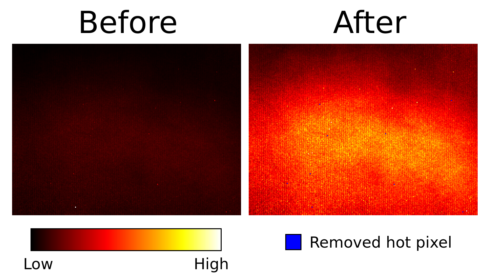

# DVS Hot Pixel Filter

Sometimes, you have a rosbag that contains hot pixels that fire many noise events.
This package automatically detects hot pixels and creates a new rosbag without hot pixel events.

To use it:

        rosrun dvs_hot_pixel_filter dvs_hot_pixel_filter path_to_input.bag <number_of_hot_pixels>


The last parameter ```<number_of_hot_pixels>``` is optional.
If no value is given, it will try to automatically detect hot pixels.

A new rosbag will be written, name ```input.bag.filtered```. It is an exact copy of the original bag, except hot pixel events have been removed.

## Statistics

Saves output statistics to ```./stats/<bag_name>/```.


### Hot Pixels List

```hot_pixels.txt``` contains a list of hot pixel coordinates with format: ```x, y```.

### Event Count Histogram

The package will output histograms before and after the hot pixels have been removed.



